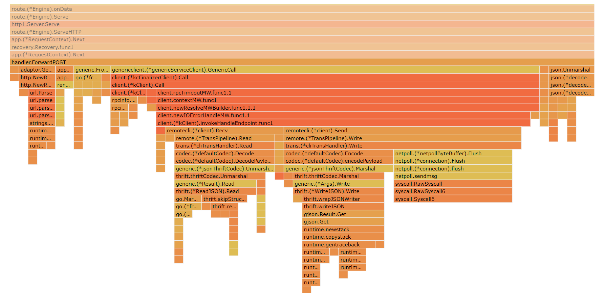
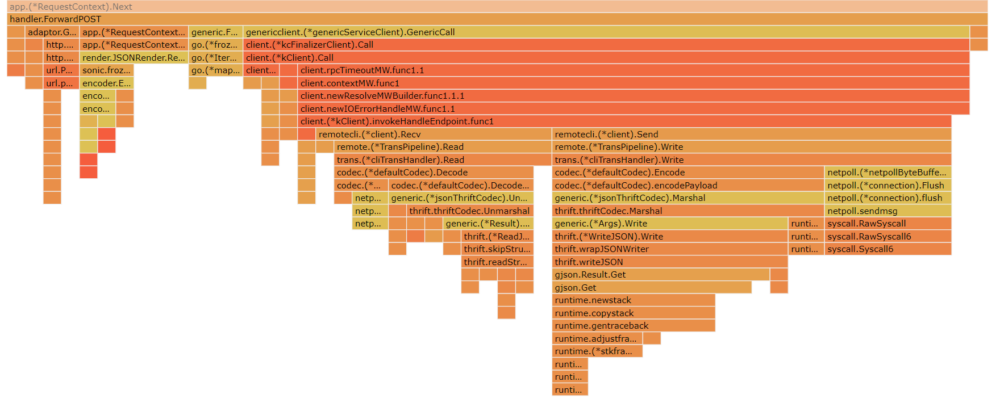

## 测试优化文档

主要通过pprof测试时间、空间占用情况

### 一、数据库查询优化
### 1. 测试查询

**运行测试：**  

在第一个终端运行压测
```bash
    echo '{"id":1} >> post_data.txt
    ab -n 100000 -c 10 -p post_data.txt -T application/json -H "Content-Type: application/json" http://localhost:8888/api/kitex.demo/Query
```
在第二个终端运行pprof ui：
```bash 
    go tool pprof -http=:8081 http://localhost:8083
```
等30秒，pprof的网页就可以自动生成


ab的输出
```
Percentage of the requests served within a certain time (ms)
  50%     61
  66%     63
  75%     65
  80%     66
  90%     71
  95%    242
  98%    258
  99%    267
 100%   1341 (longest request)
 ```

可以看到数据库查询占用了相当长的时间，因此考虑加缓存

**加了缓存后的效果**


ab的输出
```
Percentage of the requests served within a certain time (ms)
  50%      2
  66%      2
  75%      3
  80%      3
  90%      4
  95%      5
  98%      7
  99%      9
 100%    125 (longest request)
 ```


### 二、json处理优化
观察网关层的火焰图可以发现，除了generic call之外，json.Unmarshal也占用了较长时间。考虑使用性能较高的开源gjson库。


可以看到新的火焰图中json.Unmarshal几乎已经没有时间占用了
