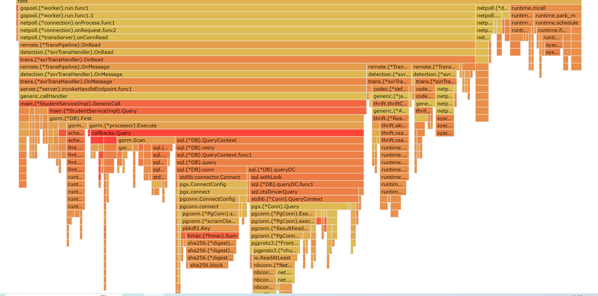

## 测试优化文档

主要通过pprof测试时间、空间占用情况

### 一、测试方法

**运行测试：**  

在第一个终端运行压测
```bash
    echo '{"id":1}' >> post_data.txt
    ab -n 100000 -c 10 -p post_data.txt -T application/json -H "Content-Type: application/json" http://localhost:8888/api/kitex.demo/Query
```
在第二个终端运行pprof ui：
```bash 
    go tool pprof -http=:8081 http://localhost:8083
```
收集网页的top数据，火焰图数据以及ab的输出数据


ab压测分别测试了10并发和100并发两种情况

### 二、json处理优化
观察网关层的火焰图可以发现，除了generic call之外，json.Unmarshal也占用了较长时间。网关层不需要json的解析，优化选择删除json.Unmardhal和json.Marshal，直接传字符串


```golang

  //cmd/biz/handler/gateway.go
  
	c.String(consts.StatusOK, resp.(string))

```

可以看到新的火焰图中json.Unmarshal几乎已经没有时间占用了


优化前后ab时间对比，CPU耗时明显降低了：（下面的数据是10并发情况下，6次测试的平均值）
```bash
//优化前
Percentage of the requests served within a certain time (ms)
  50%      1
  66%      1
  75%      1
  80%      1
  90%      1.33
  95%      1.83
  98%      2.83
  99%      3.66
 100%     46.66 (longest request)


//优化后
Percentage of the requests served within a certain time (ms)
  50%      1
  66%      1
  75%      1
  80%      1
  90%      1  
  95%      1.16
  98%      1.33
  99%      2.33
 100%     38.66 (longest request)
```


### 三、连接池处理优化
观察10并发，100并发，正常运行一次压力测试的pprof的top
```java
//10并发
Showing top 10 nodes out of 225
      flat  flat%   sum%        cum   cum%
   12340ms 27.67% 27.67%    12340ms 27.67%  runtime/internal/syscall.Syscall6
    2690ms  6.03% 33.71%     2690ms  6.03%  runtime.futex
     890ms  2.00% 35.70%      890ms  2.00%  runtime.nextFreeFast (inline)
     870ms  1.95% 37.65%     1100ms  2.47%  runtime.step
     740ms  1.66% 39.31%     2220ms  4.98%  runtime.pcvalue
     620ms  1.39% 40.70%     3860ms  8.66%  runtime.mallocgc
     560ms  1.26% 41.96%      560ms  1.26%  runtime.memmove
     540ms  1.21% 43.17%     4460ms 10.00%  runtime.gentraceback
     530ms  1.19% 44.36%      580ms  1.30%  runtime.findfunc
     520ms  1.17% 45.53%      520ms  1.17%  runtime.memclrNoHeapPointers

//100并发
Showing top 10 nodes out of 256
      flat  flat%   sum%        cum   cum%
   15390ms 24.62% 24.62%    15390ms 24.62%  runtime/internal/syscall.Syscall6
    1550ms  2.48% 27.10%     6870ms 10.99%  runtime.mallocgc
    1060ms  1.70% 28.79%     1290ms  2.06%  runtime.step
     990ms  1.58% 30.37%      990ms  1.58%  runtime.nextFreeFast (inline)
     940ms  1.50% 31.88%      940ms  1.50%  runtime.futex
     830ms  1.33% 33.21%     2560ms  4.09%  runtime.pcvalue
     800ms  1.28% 34.48%     2140ms  3.42%  runtime.scanobject
     720ms  1.15% 35.64%      720ms  1.15%  runtime.memmove
     720ms  1.15% 36.79%      840ms  1.34%  runtime.writeHeapBits.flush
     700ms  1.12% 37.91%      920ms  1.47%  runtime.findObject
```
占用时间最长的是genericcall中的syscall6，而futex在10并发情况下占用也相当大。代码在实现时一直在复用同一个genericclient，因此猜测可能是在并发的情况下一个client有点不够用。考虑引入客户端连接池，保存10个client，轮流使用。

```golang
  //provider.go
var gCliCount = make(map[string]int)
var gCliPool = make(map[string][10]*genericclient.Client)
var mutex sync.Mutex
```

**优化前后时间对比**
- 10并发

```
//优化前
Percentage of the requests served within a certain time (ms)
  50%      1
  66%      1
  75%      1
  80%      1
  90%      1  
  95%      1.16
  98%      1.33
  99%      2.33
 100%     38.66 (longest request)

//优化后
Percentage of the requests served within a certain time (ms)
  50%      1
  66%      1
  75%      1
  80%      1
  90%      1
  95%      2
  98%      2.6
  99%      3.4
 100%     52.6 (longest request)

```
在10并发下，效率反而降低了，推测是因为10并发情况下连接池作用并不大，而引入连接池额外的消耗占据了上风

- 100并发
```
//优化前
Percentage of the requests served within a certain time (ms)
  50%      4.125
  66%      5
  75%      5.875
  80%      6
  90%      7.375 
  95%      8.75
  98%      11.125
  99%      13.25
 100%      1121.625 (longest request)

//优化后
Percentage of the requests served within a certain time (ms)
  50%      4
  66%      4.4
  75%      5.2
  80%      5.4
  90%      6.6
  95%      7.6
  98%      9.6
  99%      10.8
 100%      257.8 (longest request)

```

可见在100并发的情况下，连接池对CPU效率的正面作用就大于负面作用，连接池在高并发情况下可以优化