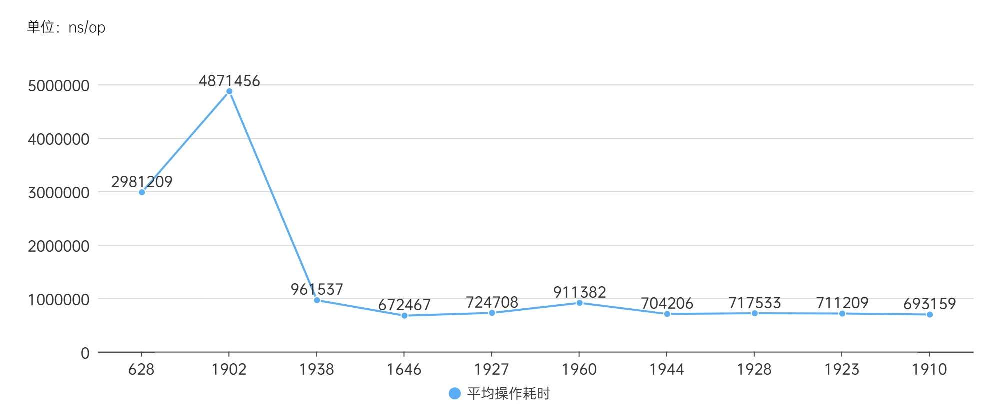
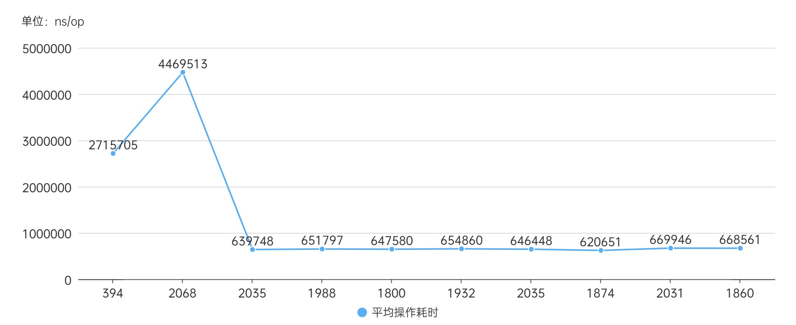
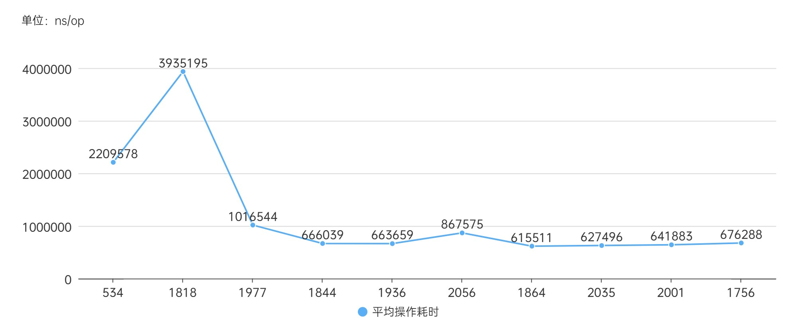
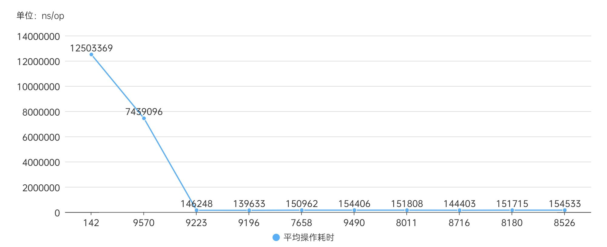
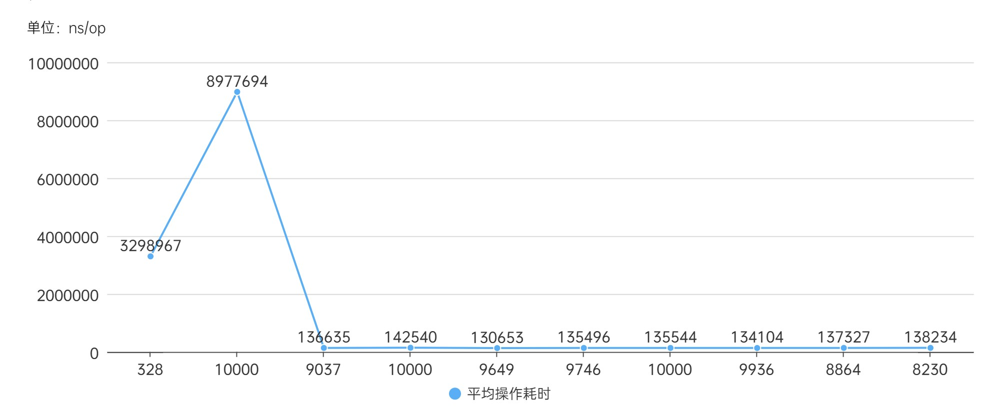
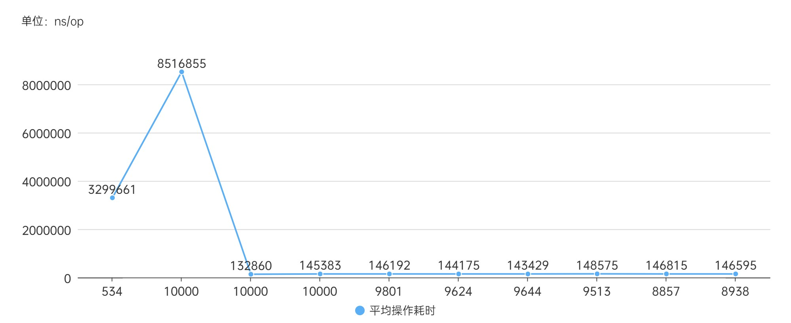

# 测试结果分析
本文档按照测试方案分类，对优化前及优化后的测试数据进行分析
## go基准测试
所用图表横坐标轴下数字为操作数，横坐标为测试顺序，纵坐标为ns/op（单次操作耗时）。
### 串行测试
**优化前**

**优化后**

**优化后但不启用连接池**

### 并行测试
**优化前**

**优化后**

**优化后但不启用连接池**

### 数据分析
由于测试场景自身因素（目标服务包含存、取操作，相同数据第一次发送会占用更多时间，第二次之后用时大大减少），测试的前两次耗时都会额外长，随后慢慢稳定。此外在测试中还出现一些显然属于误差的数据，因此我们只需关注后8次的测试数据。

串行测试的后八次数据平均值在三个场景中分别在762025、649949、721874

并行测试的后八次数据平均值在三个场景中分别在149213、136316、144253

比较优化前后的数据，可以看出优化是成功的。
## JMeter测试
### 并发度10
**优化前**

|Label	|# Samples	|Average	|Median	|90% Line	|95% Line	|99% Line	|Min	|Max	|Error %	|Throughput	|Received KB/sec	|Sent KB/sec|
|-----|-----|-----|-----|-----|-----|-----|-----|-----|-----|-----|-----|-----|
|HTTP Request	|755782	|0	|1	|1	|1	|2	|0	|222	|0.00%	|12609.60675	|2179.59	|4112.9|
|TOTAL	|755782	|0	|1	|1	|1	|2	|0	|222	|0.00%	|12609.60675	|2179.59	|4112.9|

**优化后**
|Label	|# Samples	|Average	|Median	|90% Line	|95% Line	|99% Line	|Min	|Max	|Error %	|Throughput	|Received KB/sec	|Sent KB/sec|
|-----|-----|-----|-----|-----|-----|-----|-----|-----|-----|-----|-----|-----|
|HTTP Request	|804587	|0	|1	|1	|1	|2	|0	|168	|0.00%	|13423.65444	|2241.65	|4378.42|
|TOTAL	|804587	|0	|1	|1	|1	|2	|0	|168	|0.00%	|13423.65444	|2241.65	|4378.42|

**优化后但不启用连接池**
|Label	|# Samples	|Average	|Median	|90% Line	|95% Line	|99% Line	|Min	|Max	|Error %	|Throughput	|Received KB/sec	|Sent KB/sec|
|-----|-----|-----|-----|-----|-----|-----|-----|-----|-----|-----|-----|-----|
|HTTP Request	|812904	|0	|1	|1	|1	|2	|0	|173	|0.00%	|13562.64077	|2264.86	|4423.75|
|TOTAL	|812904	|0	|1	|1	|1	|2	|0	|173	|0.00%	|13562.64077	|2264.86|	4423.75|

### 并发度100
**优化前**
|Label	|# Samples	|Average	|Median	|90% Line	|95% Line	|99% Line	|Min	|Max	|Error %	|Throughput	|Received KB/sec	|Sent KB/sec|
|-----|-----|-----|-----|-----|-----|-----|-----|-----|-----|-----|-----|-----|
|HTTP Request	|1159445	|5	|4	|8	|10	|15	|0	|161	|0.00%	|19341.81333	|3343.26	|6308.76|
|TOTAL	|1159445	|5	|4	|8	|10	|15	|0	|161	|0.00%	|19341.81333	|3343.26|	6308.76|

**优化后**
|Label	|# Samples	|Average	|Median	|90% Line	|95% Line	|99% Line	|Min	|Max	|Error %	|Throughput	|Received KB/sec	|Sent KB/sec|
|-----|-----|-----|-----|-----|-----|-----|-----|-----|-----|-----|-----|-----|
|HTTP Request   |1257059	|4	|4	|8	|9	|15	|0	|183	|0.00%	|20969.1566	|3501.69|	6839.55|
|TOTAL	|1257059	|4	|4	|8	|9	|15	|0	|183	|0.00%	|20969.1566	|3501.69|	6839.55|

**优化后但不启用连接池**
|Label	|# Samples	|Average	|Median	|90% Line	|95% Line	|99% Line	|Min	|Max	|Error %	|Throughput	|Received KB/sec	|Sent KB/sec|
|-----|-----|-----|-----|-----|-----|-----|-----|-----|-----|-----|-----|-----|
|HTTP Request	|1238998	|4	|4	|8	|10	|15	|0	|177	|0.00%	|20667.87883	|3451.37	|6741.28|
|TOTAL	|1238998	|4	|4	|8	|10	|15	|0	|177	|0.00%	|20667.87883	|3451.37	|6741.28|

### 数据分析
10并发度的测试结果中，优化后比优化前好；但从吞吐量等指标来看，关闭连接池又比开启连接池好一些。我们认为，这是由于连接池给每次操作带来了额外的性能开销。

100并发度的测试结果则符合预期：优化后比优化前好，开启连接池比不开好。

100并发度的情况下，每个“用户”从原来100个用户竞争1个客户端的情况变成了竞争10个客户端。
粗略来说，从排100人的队变成了排10人的队，每个客户省去了90次请求的等待时间；而并发度10时，不过是从排10人队变成不排队，省去10次请求时间。这样计算，100并发度时连接池节省的时间是10并发度时的节省的时间的9倍。因此，100并发度时连接池的优势才体现出来。

综上，在高并发度情况下，连接池操作消耗的时间是小于节省的时间的；因此我们认为连接池优化是成功的。

